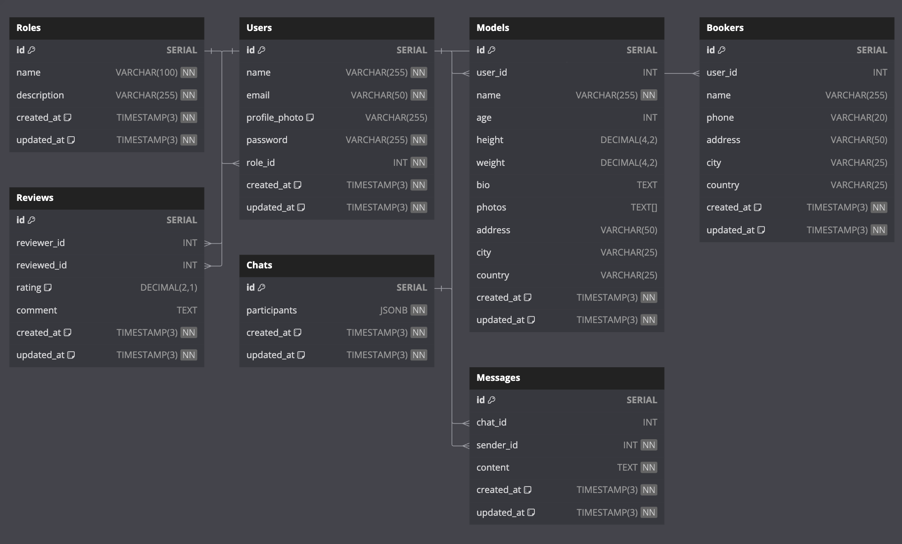

# Hire-Go
A platform to connect clients and professionals.

## Project Structure
We will define our initial project structure as follows:

.
├── CODEOWNERS                    # Define os responsáveis por diferentes partes do código.
├── README.md                     # Documentação principal do projeto.
├── cmd
│   └── main.go                   # Arquivo de entrada principal para iniciar a aplicação.
├── config
│   ├── server.go                 # Configuração do servidor.
│   └── websocket.go              # Configuração para WebSocket.
├── db.png                        # Imagem representando o esquema do banco de dados.
├── docker-compose.yml            # Arquivo de configuração para Docker Compose.
├── dockerfile                    # Dockerfile para criar a imagem da aplicação.
├── go.mod                        # Arquivo de dependências do Go.
├── go.sum                        # Checksum das dependências do Go.
├── internal
│   ├── database
│   │   ├── db.go                 # Configuração de conexão ao banco de dados.
│   │   └── migrations            # Sql Queries
│   ├── handler
│   │   ├── auth.go               # Roteamento e lógica de autenticação.
│   │   ├── booker.go             # Handler para operações de booker.
│   │   ├── model.go              # Handler para operações de modelo.
│   │   ├── role.go               # Handler para gerenciamento de roles.
│   │   └── user.go               # Handler para operações de usuário.
│   ├── middleware
│   │   ├── auth.go               # Middleware para autenticação.
│   │   └── token.go              # Middleware para validação de tokens.
│   ├── models
│   │   ├── booker.go             # Modelo para dados de bookers.
│   │   ├── chat.go               # Modelo para chats.
│   │   ├── login.go              # Modelo para login.
│   │   ├── model.go              # Modelo para dados de modelos.
│   │   ├── review.go             # Modelo para reviews.
│   │   ├── role.go               # Modelo para roles.
│   │   └── user.go               # Modelo para usuários.
│   ├── service
│   │   ├── booker.go             # Lógica de negócios para bookers.
│   │   ├── login.go              # Lógica de negócios para login.
│   │   ├── model.go              # Lógica de negócios para modelos.
│   │   ├── role.go               # Lógica de negócios para roles.
│   │   └── user.go               # Lógica de negócios para usuários.
│   └── utils
│       ├── hash.go               # Funções utilitárias para hashing.
│       └── validator.go          # Validações comuns para entradas de dados.
└── makefile                      # Script para tarefas automatizadas de build/testes.

## Technologies
- **API Framework**: Gin
- **ORM**: Gorm
- **Database**: PostgreSQL
- **Containerization**: Docker
- **Container Orchestration**: Kubernetes (K8s)
- **Logger**: zerolog
- **API Documentation**: Swaggo
- **Database Migrations**: golang-migrate
- **Validation**: go-playground/validator

## Database schema

